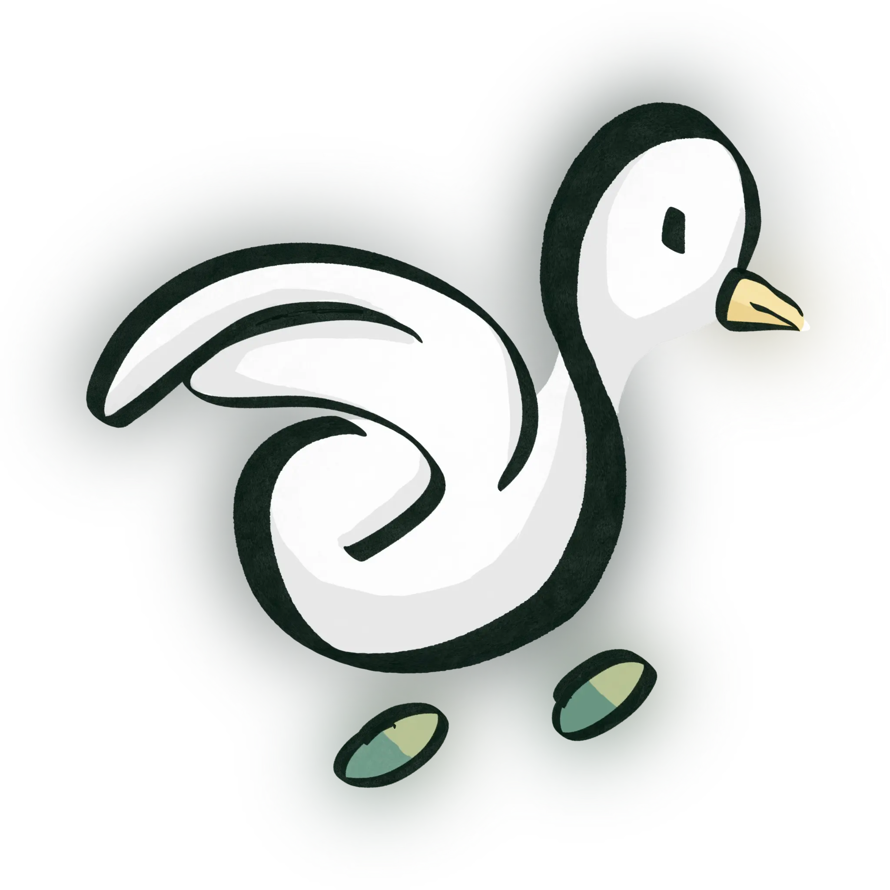

# GOOSE 🪿

**O**pens work**O**ut for **S**EU und**E**rgraduates

## 🪿 关于项目

GOOSE 是一个开源 Python 项目，旨在帮助 SEU 的本科生更好地进行课外锻炼。它提供了一个简单易用的界面，允许用户记录和跟踪他们的锻炼进度。GOOSE 通过将数据直接上传到服务器，避免了需要使用官方小程序进行打卡上传的麻烦。只需在本地运行 GOOSE，进行一些简单的配置，就可以轻松地将锻炼数据上传到服务器。

GOOSE 是自由软件，遵循 [GPLv3 许可证](LICENSE)。你可以自由地使用、修改和分发它。我们鼓励用户参与到项目中来，提出建议和贡献代码。

> 💡 **自由软件意味着**
>
> - 免费：你可以免费使用它，无需向任何人支付任何费用。
> - 开源：你可以查看源代码，了解它是如何工作的。
> - 可修改：你可以根据自己的需要修改源代码，添加新功能或修复错误。
> - 可分发：你可以将修改后的版本分发给其他人，分享你的改进。

### 为什么叫 GOOSE？

> GOOSE 不仅是个名字。它是一种精神、一种态度，是……一个递归缩写，就像 "GNU is Not Unix" 或者 "Wine Is Not an Emulator" 一样。

GOOSE 的全称是 "**G**OOSE **O**pens work**O**ut for **S**EU und**E**rgraduates"。

当然，也可以有其他的解释：

- **G**OOSE **O**rchestrates work**O**ut of **S**EU, **E**xclaim!
- **G**ood s**O**lution for work**O**uts in **SE**U
- **G**OOSE **O**ffers **O**pen-**S**ource **E**mpowerment
- **G**OOSE **O**pen **O**utdoor **S**ports for **E**veryone
- **G**OOSE **O**pen, **O**ffended by **S**EU **E**xercise
- **G**OOSE **O**pposes **O**verpriced **S**EU **E**xercise

或者任何你能想到的其他解释：因为 GOOSE 是自由的，我们希望你对它的理解和使用也能是自由的；更进一步地，我们希望这只大鹅能帮助你找到自由。

### 图标/吉祥物

GOOSE 的图标由 GOOSE 五个字母变形而来，绘制了一只张开翅膀的大鹅（虽然它看起来更像一只鸭子），配色灵感则来自于 SEU 的校徽。~~两个 O 组成的脚上色像药丸才不是 SEU 吃枣药丸的意思。~~

如果你有更好的设计，欢迎提交 PR！我们会考虑将其纳入项目中。

### 相关工具

- [PRTS](https://github.com/leostudiooo/PRTS) 是用于编辑路径点的网页工具。可以直接访问 [prts.烫烫烫的锟斤拷.top](https://prts.烫烫烫的锟斤拷.top) 使用。